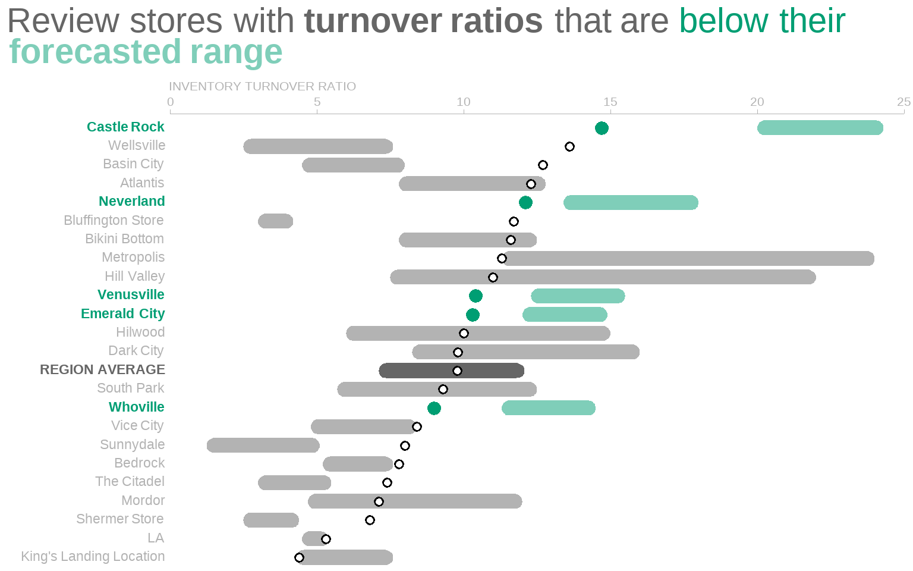
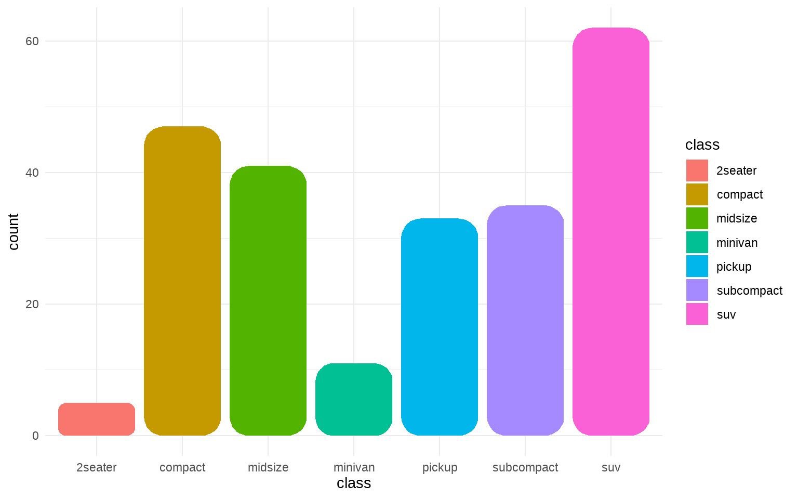

A standard ggplot output can rarely convey a powerful message. For
effective data visualization you need to customize your plot. [A couple
of weeks
ago](https://albert-rapp.de/post/2022-03-29-recreating-the-swd-look/), I
showed you how.

In this blog post, I will rebuild another great data viz from scratch.
If you have read my original blog post, then you won't have to learn
many new tricks. Most of the techniques that I use can be found there.
This is also why I save explanations only for the parts that are new.
This should keep this blog post a bit shorter. You're welcome.

Nevertheless, in today's installment of my [ggplot2
series](https://albert-rapp.de/series/ggplot2-tips/) I will teach you
something truly special. I will teach you how to create...\*drum
roll\*...rounded rectangles. Sounds exciting, doesn't it? Well, maybe
not. But it looks great. Check out what we'll build today.


This plot comes to you via another excellent entry of the [storytelling
with data (SWD)
blog](https://www.storytellingwithdata.com/blog/bar-charts-and-dot-plots-and-line-graphs-oh-my).
To draw rectangles with rounded rectangles we can leverage the
[ggchicklet package](https://github.com/hrbrmstr/ggchicklet). Though,
for some mysterious reason, the `geom_*` that we need is hidden in that
package. Therefore, we will have to dig it out. That's the easy way to
do it. And honestly, this is probably also the practical way to do it.

However, every now and then I want to do things the hard way. So, my
dear reader, this is why I will also show you how to go from rectangles
to rounded rectangles the hard way. But only after showing you the easy
way first, of course. Only then, in the second part of this blog post,
will I take the sadistically-inclined among you on a tour to the world
of grobs.

Grobs, you say? [Is that an
instrument](https://www.youtube.com/watch?v=71GWS3ccmvI)? No, Patrick,
it is an **gr**aphical **ob**ject. Under the hood, we can transform a
ggplot to a list of graphical objects. And with a few hacks, we can
adjust that list. This way, the list will contain not `rectGrobs` but
`roundrectGrobs`. Then, we can put everything back together, close the
hood and enjoy our round rectangles. Now, enough intro, let's go.

## Basic plot

First, let us recreate the "bad" plot that the above SWD blog post
remodels. In the end, we will work on the remodeled data viz too. As
always, though, there is something to be learnt from [creating an ugly
plot](https://www.allisonhorst.com/post/do-your-worst/). So, here's the
beast that we will build.

<figure>

<figcaption aria-hidden="true">Source: <a
href="https://www.storytellingwithdata.com/blog/bar-charts-and-dot-plots-and-line-graphs-oh-my">Storytelling
with data (SWD) blog</a></figcaption>
</figure>

### Read data

I didn't find the underlying data and had to guess the values from the
plot. Thus, I probably didn't get the values exactly right. But for our
purposes this should suffice. If you want, you can download the European
csv-file that I created
[here](https://albert-rapp.de/post/2022-05-01-use-grobs-to-get-rounded-corners/ratios.csv).

``` r
library(tidyverse)
# Use read_csv2 because it's an European file
dat <- read_csv2('ratios.csv')
```

### Compute averages

Let me point out that taking the average of the ratios may not
necessarily give an appropriate result (in a statistical kind of sense).
But, once again, this should not bother us as we only want to learn how
to plot.

``` r
avgs <- dat %>% 
  pivot_longer(
    cols = -1,
    names_to = 'type',
    values_to = 'ratio'
  ) %>% 
  group_by(type) %>% 
  summarise(ratio = mean(ratio)) %>% 
  mutate(location = 'REGION AVERAGE')
avgs
## # A tibble: 3 x 3
##   type               ratio location      
##   <chr>              <dbl> <chr>         
## 1 inventory_turnover  9.78 REGION AVERAGE
## 2 store_lower         7.11 REGION AVERAGE
## 3 store_upper        12.1  REGION AVERAGE

### Combine with data 
dat_longer <- dat %>% 
  pivot_longer(
    cols = -1,
    names_to = 'type',
    values_to = 'ratio'
  ) 
dat_longer_with_avgs <- dat_longer %>% 
  bind_rows(avgs)
```

### Create bars

``` r
## Colors we will use throughout this blog post
color_palette <- thematic::okabe_ito(8)

# Make sure that bars are in the same order as in the data set
dat_factored <- dat_longer %>% 
  mutate(location = factor(location, levels = dat$location)) 

p <- dat_factored %>% 
  ggplot(aes(location, ratio)) +
  geom_col(
    data = filter(dat_factored, type == 'inventory_turnover'),
    fill = color_palette[2]
  ) +
  theme_minimal()
p
```


### Turn labels and get rid of axis text

``` r
p <- p +
  labs(x = element_blank(), y = element_blank()) +
  theme(
    axis.text.x = element_text(angle = 50, hjust = 1)
  )
p
```


### Remove expansion to get x-labels closer to the bars

``` r
p <- p + coord_cartesian(ylim = c(0, 30), expand = F)
p
```


### Remove other grid lines

``` r
p <- p + 
  theme(
    panel.grid.minor = element_blank(),
    panel.grid.major.x = element_blank(),
    panel.grid.major.y = element_line(colour = 'black', size = 0.75)
  )
p
```


### Format y-axis

``` r
p <- p +
  scale_y_continuous(
    breaks = seq(0, 30, 5),
    labels = scales::label_comma(accuracy = 0.1)
  )
p
```


### Add points

``` r
p <- p +
  geom_point(
    data = filter(dat_factored, type == 'store_lower'),
    col = color_palette[1],
    size = 3
  ) +
  geom_point(
    data = filter(dat_factored, type == 'store_upper'),
    col = color_palette[3],
    size = 3
  ) 
p
```


### Add average lines

``` r
p <- p +
  geom_hline(
    yintercept = avgs[[3, 'ratio']], 
    size = 2.5, 
    col = color_palette[3]
  ) +
  geom_hline(
    yintercept = avgs[[2, 'ratio']], 
    size = 2.5, 
    col = color_palette[1]
  )
p
```


### Add text labels

``` r
p +
  geom_text(
    data = filter(dat_factored, type == 'inventory_turnover'),
    aes(label = scales::comma(ratio, accuarcy = 0.1)),
    nudge_y = 0.8,
    size = 2.5
  )
```


## Improved plot

Now, let us begin building the improved plot. First, let us get the long
labels onto the y-axis and use regular rectangles before we worry about
the rounded rectangles.

### Flip axes and use rectangles to show upper and lower bounds.

Unfortunately, `geom_rect()` does not work as intended.

``` r
dat_with_avgs <- dat_longer_with_avgs %>% 
  pivot_wider(
    names_from = 'type',
    values_from = 'ratio'
  ) 

dat_with_avgs %>% 
  ggplot() +
  geom_rect(
    aes(
      xmin = store_lower, 
      xmax = store_upper, 
      ymin = location, 
      ymax = location
    )
  )
```


Instead, let us create a new numeric column containing a location's rank
based on its `inventory_turnover`. This is done with `row_number()`.
While we're at it, let us create a new tibble that also contains
information on the colors each geom will use. Then, we can map to these
new columns in ggplot and make sure that the values are used as is by
setting `scale_*_identity()`. This is one convenient way to control the
aesthetics of each geom [without functional
programming](http://localhost:4321/post/2022-03-25-functional-programming-when-geoms-are-not-vectorized/#how-do-i-manually-set-aesthetics-with-aes-and-scale__identity).
With the image from above in mind, we know that our final plot will need

-   different `col`, `fill` and `size` values in `geom_point()`
-   different `fill` and `alpha` values in `geom_rect()`

Here's what this tibble looks like.

``` r
bar_height <- 0.4 
no_highlight_col <- 'grey70'
average_highlight_col <- 'grey40'
below_highlight <- color_palette[2]

sorted_dat <- dat_with_avgs %>% 
  mutate(num = row_number(inventory_turnover)) %>% 
  # Sort so that everything is in order of rank
  # Important for text labels later on
  arrange(desc(num)) %>% 
  mutate(
    rect_color = case_when(
      inventory_turnover < store_lower ~ below_highlight,
      location == 'REGION AVERAGE' ~ average_highlight_col,
      T ~ no_highlight_col
    ),
    rect_alpha = if_else(
      inventory_turnover < store_lower,
      0.5,
      1
    ),
    point_color = if_else(
      inventory_turnover < store_lower,
      below_highlight,
      'black'
    ),
    point_fill = if_else(
      inventory_turnover < store_lower,
      below_highlight,
      'white'
    ),
    point_size = if_else(
      inventory_turnover < store_lower,
      3,
      2
    )
  )
sorted_dat
## # A tibble: 24 x 10
##    location inventory_turno~ store_upper store_lower   num rect_color rect_alpha
##    <chr>               <dbl>       <dbl>       <dbl> <int> <chr>           <dbl>
##  1 Castle ~             14.7        24.3        20      24 #009E73           0.5
##  2 Wellsvi~             13.6         7.6         2.5    23 grey70            1  
##  3 Basin C~             12.7         8           4.5    22 grey70            1  
##  4 Atlantis             12.3        12.8         7.8    21 grey70            1  
##  5 Neverla~             12.1        18          13.4    20 #009E73           0.5
##  6 Bluffin~             11.7         4.2         3      19 grey70            1  
##  7 Bikini ~             11.6        12.5         7.8    18 grey70            1  
##  8 Metropo~             11.3        24          11.3    17 grey70            1  
##  9 Hill Va~             11          22           7.5    16 grey70            1  
## 10 Venusvi~             10.4        15.5        12.3    15 #009E73           0.5
## # ... with 14 more rows, and 3 more variables: point_color <chr>,
## #   point_fill <chr>, point_size <dbl>
```

Now, we can create our plot. Notice that I set `shape = 21` in
`geom_point()` to use both the `fill` and `col` aesthetic.

``` r
sorted_dat %>% 
  ggplot() +
  geom_rect(
    aes(
      xmin = store_lower, 
      xmax = store_upper, 
      ymin = num - bar_height, 
      ymax = num + bar_height, 
      fill = rect_color,
      alpha = rect_alpha
    ),
  ) +
  geom_point(
    aes(
      x = inventory_turnover,
      y = num,
      fill = point_fill,
      col = point_color,
      size = point_size
    ),
    shape = 21,
    stroke = 1
  ) +
  scale_fill_identity() +
  scale_color_identity() +
  scale_size_identity() +
  scale_alpha_identity() +
  theme_minimal()
```


### Use ggchicklet for rounded rectangles

The whole point of this blog post is to use rounded rectangles. So let's
do that. The [ggchicklet
package](https://github.com/hrbrmstr/ggchicklet) has a geom called
`geom_rrect()`. It works just like `geom_rect()` but accepts another
value `r` which is used to determine the radius of the rounded
rectangles. Unfortunately, this geom is not an exported function of this
package. This means that if you write `ggchicklet::` (e.g. in RStudio)
and press `TAB` you won't see `geom_rrect()`. Thus, you have to access
the internal function via `:::` (three colons).

``` r
p <- sorted_dat %>% 
  ggplot() +
  ggchicklet:::geom_rrect(
    aes(
      xmin = store_lower, 
      xmax = store_upper, 
      ymin = num - bar_height, 
      ymax = num + bar_height, 
      fill = rect_color,
      alpha = rect_alpha
    ),
    # Use relative npc unit (values between 0 and 1)
    # This ensures that radius is not too large for your canvas
    r = unit(0.5, 'npc')
  ) +
  geom_point(
    aes(
      x = inventory_turnover,
      y = num,
      fill = point_fill,
      col = point_color,
      size = point_size
    ),
    shape = 21,
    stroke = 1
  ) +
  scale_fill_identity() +
  scale_color_identity() +
  scale_size_identity() +
  scale_alpha_identity() +
  theme_minimal()
p
```


### Remove grid lines, move axis and add some text elements

We will set the y-axis labels manually later on. Otherwise, we cannot
change its colors one-by-one. For now, let's get rid of superfluous grid
lines, move the x-axis and add a title.

Notice that I draw the axis line manually with a segment annotation.
This seems weird, I know. Unfortunately, it cannot be helped because I
still need room for the y-axis labels. And if I do not plot the axis
line manually, then the axis line will start all the way to the left.
Make sure that you set `clip = 'off'` in `coord_cartesian()` for the
annotation to be displayed.

``` r
title_lab <- 'Review stores with turnover ratios that are below their\nforecasted range'
title_size <- 14
axis_label_size <- 8
text_size <- 18
p <- p +
  scale_x_continuous(
    breaks = seq(0, 25, 5),
    position = 'top'
  ) +
  coord_cartesian(
    xlim = c(-5, 25), 
    ylim = c(0.75, 24.75),  
    expand = F,
    clip = 'off'
  ) +
  annotate(
    'segment',
    x = 0,
    xend = 25,
    y = 24.75,
    yend = 24.75,
    col = no_highlight_col,
    size = 0.25
  ) +
  labs(
    x = 'INVENTORY TURNOVER RATIO',
    y = element_blank(),
    title = title_lab
  ) +
  theme(
    text = element_text(
      size = text_size,
      color = average_highlight_col
    ),
    plot.title.position = 'plot',
    panel.grid = element_blank(),
    axis.title.x = element_text(
      size = axis_label_size,
      hjust = 0.21,
      color = no_highlight_col
    ),
    axis.text.x = element_text(
      size = axis_label_size,
      color = no_highlight_col
    ),
    axis.ticks.x = element_line(color = no_highlight_col, size = 0.25),
    axis.text.y = element_blank(),
    axis.line.x = element_blank()
  )
p
```


### Add y-axis labels

``` r
y_axis_text_size <- 3
p +
  geom_text(
    aes(
      x = 0,
      y = num,
      label = location,
      col = no_highlight_col,
      hjust = 1,
      size = y_axis_text_size
    )
  )
```


### Highlight words

Let us turn to text highlights. For that we will need `ggtext`. This
will let us use `geom_richtext()` instead of `geom_text()`. Notice that
I have note saved the last `geom_text()` modification in `p`. Otherwise,
we would get two overlapping layers of text. You can highlight single
words as demonstrated in my [blog post about effective use of
colors](https://albert-rapp.de/post/2022-02-19-ggplot2-color-tips-from-datawrapper).

``` r
library(ggtext)
sorted_dat_with_new_labels <- sorted_dat %>% 
  mutate(location_label = case_when(
    inventory_turnover < store_lower ~ glue::glue(
      '<span style = "color:{below_highlight}">**{location}**</span>'
    ),
    location == 'REGION AVERAGE' ~ glue::glue(
      '<span style = "color:{average_highlight_col}">**{location}**</span>'
    ),
    T ~ location
  ))

p <- p +
  geom_richtext(
    data = sorted_dat_with_new_labels,
    aes(
      x = 0,
      y = num,
      label = location_label,
      col = no_highlight_col,
      hjust = 1,
      size = y_axis_text_size
    ),
    label.colour = NA,
    fill = NA
  )
p
```


Fantastic! Next, we only have to highlight words in our call to action.
Make sure that `plot.title` in `theme()` is an `element_markdown()`.

``` r
title_lab_adjusted <- glue::glue(
  "Review stores with **turnover ratios** that are <span style = 'color:{below_highlight}'>below their</span><br><span style = 'color:#7fceb9;'>**forecasted range**</span>"
)

p +
  labs(title = title_lab_adjusted) +
  theme(
    plot.title = element_markdown(),
    panel.background = element_rect(color = NA, fill = 'white')
  )
```



There you go. This concludes the easy way to draw rounded rectangles
with `ggplot2` and `ggchicklet`. Now, I am well aware that this is
probably the moment when many readers will drop out. So, let me do some
shameless self-promotion before everyone's gone.

If you enjoyed this post, follow me on
[Twitter](https://twitter.com/rappa753) and/or subscribe to my [RSS
feed](https://albert-rapp.de/index.xml). For reaching out to me, feel
free to hit the comments or send me a mail. I am always happy to see
people commenting on my work.

## Rounded rectangles with grobs

Alright, this is where the hacking begins. In this last part of the blog
post, I will show you to how transform rectangles to rounded rectangles.
In principle, you could then create our SWD plot using `geom_rect()` and
transform the rectangles afterwards. No additional package needed.

### Simple example with one bar

Let me demonstrate a quick hack when there is only one bar in the plot.
Unfortunately, this does not work with more than one bar. Still, this
should get you acquainted with grobs. First, create a simple dummy plot.

``` r
library(tidyverse)
p <- mpg %>%
  filter(year == 2008) %>% 
  ggplot(aes(year)) +
  geom_bar() +
  theme_minimal()
p
```


Next, we can turn this plot into a so-called `TableGrob`. From what I
understand, it is a highly nested list that contains all the graphical
objects (grobs) that are part of our plot `p`.

``` r
l <- ggplotGrob(p)
l
## TableGrob (12 x 9) "layout": 18 grobs
##     z         cells       name                                          grob
## 1   0 ( 1-12, 1- 9) background       zeroGrob[plot.background..zeroGrob.845]
## 2   5 ( 6- 6, 4- 4)     spacer                                zeroGrob[NULL]
## 3   7 ( 7- 7, 4- 4)     axis-l           absoluteGrob[GRID.absoluteGrob.834]
## 4   3 ( 8- 8, 4- 4)     spacer                                zeroGrob[NULL]
## 5   6 ( 6- 6, 5- 5)     axis-t                                zeroGrob[NULL]
## 6   1 ( 7- 7, 5- 5)      panel                      gTree[panel-1.gTree.828]
## 7   9 ( 8- 8, 5- 5)     axis-b           absoluteGrob[GRID.absoluteGrob.831]
## 8   4 ( 6- 6, 6- 6)     spacer                                zeroGrob[NULL]
## 9   8 ( 7- 7, 6- 6)     axis-r                                zeroGrob[NULL]
## 10  2 ( 8- 8, 6- 6)     spacer                                zeroGrob[NULL]
## 11 10 ( 5- 5, 5- 5)     xlab-t                                zeroGrob[NULL]
## 12 11 ( 9- 9, 5- 5)     xlab-b titleGrob[axis.title.x.bottom..titleGrob.837]
## 13 12 ( 7- 7, 3- 3)     ylab-l   titleGrob[axis.title.y.left..titleGrob.840]
## 14 13 ( 7- 7, 7- 7)     ylab-r                                zeroGrob[NULL]
## 15 14 ( 4- 4, 5- 5)   subtitle         zeroGrob[plot.subtitle..zeroGrob.842]
## 16 15 ( 3- 3, 5- 5)      title            zeroGrob[plot.title..zeroGrob.841]
## 17 16 (10-10, 5- 5)    caption          zeroGrob[plot.caption..zeroGrob.844]
## 18 17 ( 2- 2, 2- 2)        tag              zeroGrob[plot.tag..zeroGrob.843]
```

In this case, calling `l` gave us an overview of plot parts. We will
want to change stuff in the panel. Thus, let us extract the grobs from
the sixth list entry of `l`. As we have seen in the table, this will
give us a `gTree`. That's another nested list. And it contains an
interesting sublist called `children`. That's where the grobs of this
`gTree` are stored.

``` r
grobs <- l$grobs[[6]]
grobs$children
## (gTree[grill.gTree.826], zeroGrob[NULL], rect[geom_rect.rect.814], zeroGrob[NULL], zeroGrob[panel.border..zeroGrob.815])
```

Here, the `rect` grob is what we want to access. Thus, let us take a
look what we can find there.

``` r
# str() helps us to unmask the complicated list structure
grobs$children[[3]] %>% str()
## List of 10
##  $ x     : 'simpleUnit' num 0.0455native
##   ..- attr(*, "unit")= int 4
##  $ y     : 'simpleUnit' num 0.955native
##   ..- attr(*, "unit")= int 4
##  $ width : 'simpleUnit' num 0.909native
##   ..- attr(*, "unit")= int 4
##  $ height: 'simpleUnit' num 0.909native
##   ..- attr(*, "unit")= int 4
##  $ just  : chr [1:2] "left" "top"
##  $ hjust : NULL
##  $ vjust : NULL
##  $ name  : chr "geom_rect.rect.814"
##  $ gp    :List of 6
##   ..$ col     : logi NA
##   ..$ fill    : chr "#595959FF"
##   ..$ lwd     : num 1.42
##   ..$ lty     : num 1
##   ..$ linejoin: chr "mitre"
##   ..$ lineend : chr "butt"
##   ..- attr(*, "class")= chr "gpar"
##  $ vp    : NULL
##  - attr(*, "class")= chr [1:3] "rect" "grob" "gDesc"
```

This is a grob. It can be build using `grid::rectGrob()`. Basically,
what you see here is a specification of everything from `x` and `y`
position to graphical properties (`gp`) of this rectangular grob.

There is also a function `grid::roundrectGrob()`. As you may have
guessed, it builds the rounded rectangle grobs that we so desperately
crave. From `grid::roundrectGrob()`'s documentation, we know that we
will have to specify another variable `r` to determine the radius of the
rounded rectangles. So, here's what we could do now.

1.  Extract `x`, `y`, `gp` and so on from `grobs$children[[3]]`.
2.  Add another argument `r`.
3.  Pass all of these arguments to `grid::roundrectGrob()`
4.  Exchange `grobs$children[[3]]` with our newly built `roundrectGrob`

This is what we will have to do at some point. But in this simple plot,
I want to show you a different hack. Did you notice the `class`
[attributes](https://adv-r.hadley.nz/vectors-chap.html#attributes) of
`grobs$children[[3]]`? Somewhere in there it says
`- attr(*, "class")= chr [1:3] "rect" "grob" "gDesc"`. And we can access
and change that information through `attr()`.

``` r
attr(grobs$children[3][[1]], 'class')
## [1] "rect"  "grob"  "gDesc"
```

Now, a really basic hack is to

1.  change the class attribute from `rect` to `roundrect`.
2.  stick another argument `r` into the list
3.  put everything back together as if nothing happened

``` r
## Change class attribute of grobs$children[3][[1]] from rect to roundrect
current_attr <-  attr(grobs$children[3][[1]], 'class')
new_attr <- str_replace(current_attr, 'rect', 'roundrect')
attr(grobs$children[3][[1]], 'class') <- new_attr

# Add r argument for grid::roundrectGrob()
# We need to add a "unit"
# Here I use the relative unit npc
grobs$children[3][[1]]$r <- unit(0.5, 'npc')

# Copy original list and change grobs in place
l_new <- l
l_new$grobs[[6]] <- grobs

# Draw grobs via grid::grid.draw()
grid::grid.newpage()
grid::grid.draw(l_new)
```


### Dealing with multiple bars

The previous hack works if we plot only one bar. However, if there are
multiple `x` arguments, then `grid::roundrectGrob()` will error. It
seems like that function is not vectorized. So, we will build the
rounded rectangles ourselves with functional programming. First let's
take a look at the plot that we want to modify.

``` r
p <- mpg %>%
  ggplot(aes(class, fill = class)) +
  geom_bar() +
  theme_minimal()
p
```


Now, let's find out what arguments `grid::roundrectGrob()` accepts and
extract as many of these from `grobs$children[3]` as possible.

``` r
l <- ggplotGrob(p)
grobs <- l$grobs[[6]]

# What arguments does roundrectGrob need?
arg_names <- args(grid::roundrectGrob) %>% as.list() %>% names()
# Somehow last one is NULL
arg_names <- arg_names[-length(arg_names)]
arg_names
##  [1] "x"             "y"             "width"         "height"       
##  [5] "default.units" "r"             "just"          "name"         
##  [9] "gp"            "vp"

# Extract the arguments roundrectGrob needs from grobs$children[3]
extracted_args <- map(arg_names, ~pluck(grobs$children[3], 1, .)) 
names(extracted_args) <- arg_names
extracted_args %>% str()
## List of 10
##  $ x            : 'simpleUnit' num [1:7] 0.0208native 0.16native 0.299native 0.438native 0.576native ...
##   ..- attr(*, "unit")= int 4
##  $ y            : 'simpleUnit' num [1:7] 0.119native 0.735native 0.647native 0.207native 0.529native ...
##   ..- attr(*, "unit")= int 4
##  $ width        : 'simpleUnit' num [1:7] 0.125native 0.125native 0.125native 0.125native 0.125native 0.125native 0.125native
##   ..- attr(*, "unit")= int 4
##  $ height       : 'simpleUnit' num [1:7] 0.0733native 0.689native 0.601native 0.161native 0.484native ...
##   ..- attr(*, "unit")= int 4
##  $ default.units: NULL
##  $ r            : NULL
##  $ just         : chr [1:2] "left" "top"
##  $ name         : chr "geom_rect.rect.925"
##  $ gp           :List of 6
##   ..$ col     : logi [1:7] NA NA NA NA NA NA ...
##   ..$ fill    : chr [1:7] "#F8766D" "#C49A00" "#53B400" "#00C094" ...
##   ..$ lwd     : num [1:7] 1.42 1.42 1.42 1.42 1.42 ...
##   ..$ lty     : num [1:7] 1 1 1 1 1 1 1
##   ..$ linejoin: chr "mitre"
##   ..$ lineend : chr "butt"
##   ..- attr(*, "class")= chr "gpar"
##  $ vp           : NULL
```

As you can can see, in our vector `extracted_args` the components `x`,
`y` and so on are vectors of length 7 (since we have 7 bars in `p`). As
I said before, this works because it is a `rectGrob`. But, with a
`roundrectGrob` this would cause errors.

Next, let us make sure that we know how many rectangles we need to
change. Also, we will need to specify the radius `r`, and the graphical
parameters `gp` should always have the same amount of arguments.

``` r
## How many rectangles are there?
n_rects <- extracted_args$x %>% length()

## Add radius r
extracted_args$r <- unit(rep(0.25, n_rects), 'npc')

## Make sure that all list components in gp have equally many values
extracted_args$gp$linejoin <- rep(extracted_args$gp$linejoin, n_rects)
extracted_args$gp$lineend <- rep(extracted_args$gp$lineend, n_rects)
```

Now comes the tedious part. We have to split up `extracted_args` into
multiple nested lists. Unfortunately, the `purrr` package does not
provide a function that works the way we want. That's because we need
many custom steps here. For instance, for the columns `x` and `y` we
have to always extract a single value out of `extracted_args`. But with
the columns `just` and `name` we need to extract the whole vector. Also,
we have to adjust the names to ensure that they are unique.

In this blog post, we will get the tedious stuff out of the way with the
following helper functions. Feel free to ignore them, if you only care
about the general idea.

``` r
## Write function that does splitting for each rectangle
## Found no suitable purrr function that works in my case
extract_value <- function(list, arg, rect) {
  x <- list[[arg]]
  # name and just need do be treated different
  # In all cases just pick the i-th entry of list[[arg]]
  if (!(arg %in% c('name', 'just'))) return(x[rect])
  
  ## There is only one name, so extract that and modify id
  if (arg == 'name') {
    return(paste0(x,  rect))
  }
  
  # 'just' is two part vector and should always be the same
  if (arg == 'just') return(x)
}

split_my_list <- function(list, n_rects) {
  combinations <- tibble(
    rect = 1:n_rects,
    arg = list(names(list))
  ) %>% 
    unnest(cols = c(arg)) 
  
  flattened_list <- combinations %>% 
    pmap(~extract_value(list, ..2, ..1))
  
  names(flattened_list) <- combinations$arg
  split(flattened_list, combinations$rect)
}
```

Finally, we can split `extracted_args` into sub-lists. Each of these is
then used to call `grid::roundrectGrob()` with `do.call()`. Then, we
have to replace the same part in our list `grobs` as we did before.
However, since we have multiple grobs now that need to be put into a
single location. Therefore, we have to bundle the grobs into one object.
This is done via `grid::grobTree()` and `do.call()`.

``` r
list_of_arglists <-  split_my_list(extracted_args, n_rects)
list_of_grobs <- map(list_of_arglists, ~do.call(grid::roundrectGrob, .)) 

# Build new list of grobs by replacing one part in old list
grobs_new <- grobs

# save one list argument into children[3]
grobs_new$children[3] <- do.call(grid::grobTree, list_of_grobs) %>% list()
l_new <- l
l_new$grobs[[6]] <- grobs_new

# Draw Plot
grid::grid.newpage()
grid::grid.draw(l_new)
```



## Conclusion

Woooow! Marvel at our glorious rounded rectangles! Thanks to our
excellent programming skills we made it through the grob jungle. In
practice, it is probably easier to use `geom_chicklet()`. But still,
this was a somewhat fun exercise and helped to demystify grobs (at least
to some extend).

That's it for today. If you've made it this far, then you already know
that you should follow me on [Twitter](https://twitter.com/rappa753)
and/or subscribe to my [RSS feed](https://albert-rapp.de/index.xml). So,
I expect you to be here next time. There's no way out anymore. So long!
