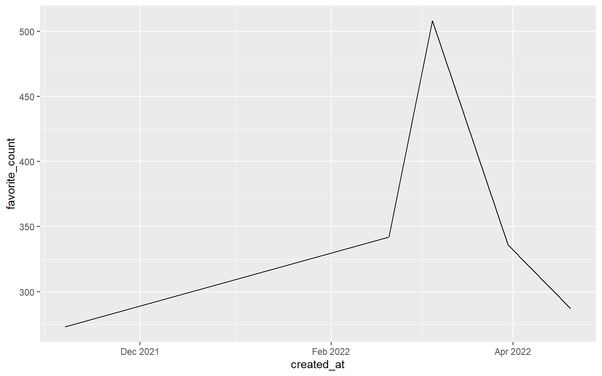
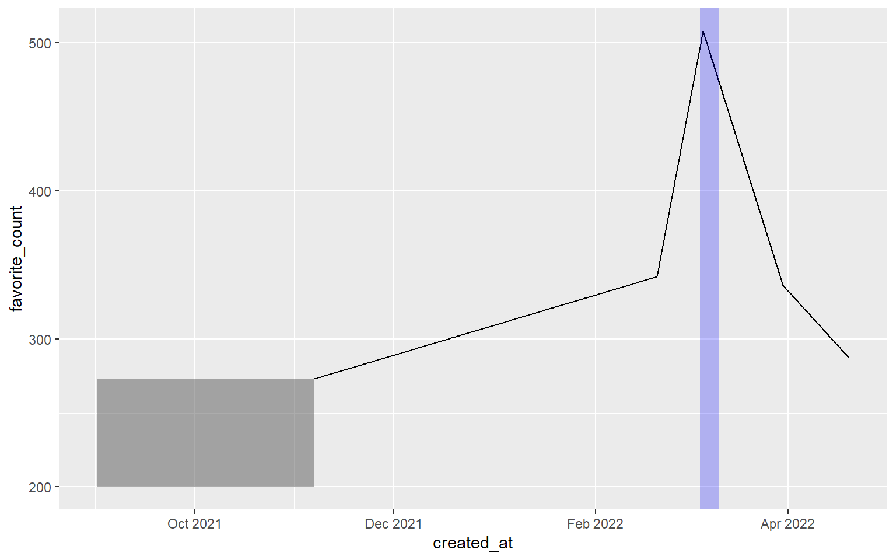

This week, I am oddly proud to announce that I have reached 1000
followers on [Twitter](https://twitter.com/rappa753). Check out the
visualization that I have created for this joyous occasion.


To me, my rising follower count and the somewhat regular mails that I
receive are a sign that people like to read my blog. And to thank you
all for following my work, let me give you a quick intro to the packages
`rtweet` and `lubridate`. These were instrumental in creating the above
visual.

## Working with rtweet

At the end of February 2022, I wondered how my follower count evolves
over time. Unfortunately, this is not something Twitter shows you by
default. The Analytics page only shows me the change within my last 28
days. To overcome this drawback, I consulted the `rtweet` package which
is a fabulous package that lets you interact with Twitter's API through
R.

In my case, I only do rudimentary work with it and track my followers
over time. For this to work, I have set up an R script that runs every
hour to download a list of my followers. Each hour, the list's length
tells me how many followers I have.

If you want to do the same, install the package first. Make sure to
install the development version from GitHub, though.

``` r
remotes::install_github("rOpenSci/rtweet")
```

### Basic functionalities

`rtweet` comes with a lot of convenient function. Most of these start
with `get_`. For instance, there are

-   `get_followers()`: This is the function to get a list of an
    account's followers.
-   `get_timeline()`: This gives you the a user's timeline like tweets,
    replies and mentions.
-   `get_retweets()`: This gives you the most recent retweets of a given
    tweet.

My aforementioned R script just runs `get_followers()` and computes the
number of rows of the resulting tibble.

``` r
library(rtweet)
tib <- get_followers('rappa753')
tib
## # A tibble: 1,018 x 1
##    user_id            
##    <chr>              
##  1 778980355457941504 
##  2 561505786          
##  3 1265356152507940870
##  4 1095327279536730117
##  5 2508861812         
##  6 253373869          
##  7 2287065422         
##  8 1491615200         
##  9 1192011365243871232
## 10 1522471850177093632
## # ... with 1,008 more rows
nrow(tib)
## [1] 1018
```

For my above visualization, I used `get_timeline()` to extract my five
most popular tweets. Here, I ranked the popularity by the count of likes
resp. "favorites" as `rtweet` likes to call it.

``` r
library(tidyverse)
tl <- get_timeline('rappa753', n = 1000)
tl_slice <- tl %>% 
  slice_max(favorite_count, n = 5) %>% 
  select(created_at, full_text, favorite_count, retweet_count) 
tl_slice
## # A tibble: 5 x 4
##   created_at                     full_text          favorite_count retweet_count
##   <chr>                          <chr>                       <dbl>         <dbl>
## 1 Sat Mar 05 20:56:33 +0000 2022 "The fun thing ab~            508            83
## 2 Sat Feb 19 17:32:23 +0000 2022 "Ever wanted to u~            342            56
## 3 Wed Mar 30 10:25:48 +0000 2022 "From standard ou~            336            58
## 4 Tue Apr 19 19:20:53 +0000 2022 "Last week, I hel~            287            46
## 5 Sat Nov 06 16:16:05 +0000 2021 "I tried to expla~            273            38
```

Notice that I tweeted two of these before I started tracking my
followers. Consequently, I ignored them for my visualization. That's a
bit of a shame because my most popular tweet is in that timeframe. It
was about a [fun R
infographic](https://twitter.com/rappa753/status/1500213701370171392).

Unfortunately, the `rtweet` package cannot do everything. For example,
the snapshot functionality `tweet_shot()` does not work anymore. I think
that's because the Twitter API changed.

This bothered me during the [30 day chart
challenge](https://twitter.com/30DayChartChall) in April because I
wanted to automatically extract great visualizations from Twitter. But
as `tweet_shot()` was not working, I had to call Twitter's API manually
without `rtweet`. If you're curious about how that works, check out my
[corresponding blog
post](https://albert-rapp.de/post/2022-04-11-get-twitter-posts-into-your-notetaking-system/).
There, I've also explained how to set up a script that gets executed,
say, every hour automatically.

### Setting up a Twitter app

This pretty much explains how `rtweet` works. In general, it is really
easy to use. And if you only want to use it only occasionally, there is
not much more to it.

However, if you want to use the package more often - as in calling the
API every hour - then you need to set up a Twitter app. You can read up
on how that works in the "Preparations" section of the [above blog
post](https://albert-rapp.de/post/2022-04-11-get-twitter-posts-into-your-notetaking-system/#preparations).
Once you've got that down, your `rtweet` calls can be authenticated
through your Twitter app like so.

``` r
auth <- rtweet::rtweet_app(
  bearer_token = keyring::key_get('twitter-bearer-token')
)
auth_as(auth)
```

Here, I have used the `keyring` package to hide the bearer token of my
Twitter app. If that doesn't mean anything to you, let me once again
refer to the [above blog
post](https://albert-rapp.de/post/2022-04-11-get-twitter-posts-into-your-notetaking-system/#preparations).
The important thing is that after these lines ran your `rtweet` calls
get funneled through your own Twitter app.

## Working with lubridate

As you saw above, the timeline that we extracted and saved in `rtweet`
contains time data. Here it is once again.

``` r
tl_slice
## # A tibble: 5 x 4
##   created_at                     full_text          favorite_count retweet_count
##   <chr>                          <chr>                       <dbl>         <dbl>
## 1 Sat Mar 05 20:56:33 +0000 2022 "The fun thing ab~            508            83
## 2 Sat Feb 19 17:32:23 +0000 2022 "Ever wanted to u~            342            56
## 3 Wed Mar 30 10:25:48 +0000 2022 "From standard ou~            336            58
## 4 Tue Apr 19 19:20:53 +0000 2022 "Last week, I hel~            287            46
## 5 Sat Nov 06 16:16:05 +0000 2021 "I tried to expla~            273            38
```

Sadly, working with times and dates is rarely pleasant. But we can make
our life a bit easier by using the `lubridate` package which was made
for that. To show you how it works, it is probably best to show you a
couple of use cases.

All of these will be taken from what I had to deal with to create my
celebratory visualization. But I simplified it to minimal examples for
this blog post. More use cases can be found in the [lubridate
cheatsheet](https://raw.githubusercontent.com/rstudio/cheatsheets/main/lubridate.pdf)
or the [tidyverse cookbook
ressource](https://bookdown.org/Tazinho/Tidyverse-Cookbook/dates-and-times.html)
by Malte Grosser.

### Parse dates and times

First, I needed to convert the `created_at` column from `character` to
`datetime` format. The easiest way to do that gets rid of `+0000` in the
character vector and then parses the vector into the right format via
`parse_date_time()`. But there is a catch. Check out what happens if I
try this on my computer.

``` r
library(lubridate)
tl_slice %>% 
  mutate(created_at = parse_date_time(
    str_remove(created_at, '\\+0000'), # remove the +0000 
    orders = 'a b d H:M:S Y'
  ))
## # A tibble: 5 x 4
##   created_at full_text                              favorite_count retweet_count
##   <dttm>     <chr>                                           <dbl>         <dbl>
## 1 NA         "The fun thing about getting better a~            508            83
## 2 NA         "Ever wanted to use colors in #ggplot~            342            56
## 3 NA         "From standard output to powerful sto~            336            58
## 4 NA         "Last week, I held a short workshop t~            287            46
## 5 NA         "I tried to explain the variance of t~            273            38
```

See how all values in `created_at` are `NA` now? That's a problem. And
we will solve it very soon. But first, let me explain how the function
call works.

The `orders` argument specifies how the vector `created_at` (without
`+0000`) is to be understood. We clarify that `created_at` contains (in
the order of appearance)

1.  abbreviated week day names (`a`)
2.  abbreviated month names (`b`)
3.  the day of the month as decimals (`d`)
4.  and so on

Where do these abbreviations `a`, `b`, `d`, etc. come from? They are
defined in the help page of `parse_date_time()`. You can find them in
the section "Details". But why does the code not work? Why do we always
get an `NA`? For once, my computer is truly the problem. Or rather, its
settings.

By default, my computer is set to German. But even if RStudio or R's
error messages are set to English, my computer's so-called "locale" may
be still be set to German. That's a problem because abbreviations like
"Sat" and "Wed" refer to the **English** words "Saturday" and
"Wednesday". So, we need to make sure that `parse_date_time()`
understands that it needs to use an English locale. Then, everything
works out.

``` r
parsed_highlights <- tl_slice %>% 
  mutate(created_at = parse_date_time(
    str_remove(created_at, '\\+0000'), # remove the +0000 
    orders = 'a b d H:M:S Y',
    locale = "English"
  ))
parsed_highlights
## # A tibble: 5 x 4
##   created_at          full_text                     favorite_count retweet_count
##   <dttm>              <chr>                                  <dbl>         <dbl>
## 1 2022-03-05 20:56:33 "The fun thing about getting~            508            83
## 2 2022-02-19 17:32:23 "Ever wanted to use colors i~            342            56
## 3 2022-03-30 10:25:48 "From standard output to pow~            336            58
## 4 2022-04-19 19:20:53 "Last week, I held a short w~            287            46
## 5 2021-11-06 16:16:05 "I tried to explain the vari~            273            38
```

We are now ready to send this data to ggplot. Since `created_at` is
formatted in datetime now, ggplot will understand what it means when we
map `x = created_at`.

``` r
parsed_highlights %>% 
  ggplot(aes(created_at, favorite_count)) +
  geom_line()
```


### Using scale_x\_date(time) and locale

Did you see that the x-axis uses German abbreviations and doesn't show
what year we're in? That's not great. Let's change that. As is always
the case when we want to format the axes we will need a `scale_*()`
function. Here, what we need is `scale_x_datetime()`.

But this won't solve our German locale problem. The easiest way to solve
that tricky ordeal is to change the locale globally via
`Sys.setlocale()`. Don't worry, though. The locale will reset after
restarting R. No permanent "damage" here.

``` r
Sys.setlocale("LC_ALL","English")
## [1] "LC_COLLATE=English_United States.1252;LC_CTYPE=English_United States.1252;LC_MONETARY=English_United States.1252;LC_NUMERIC=C;LC_TIME=English_United States.1252"
p <- parsed_highlights %>% 
  ggplot(aes(created_at, favorite_count)) +
  geom_line() +
  scale_x_datetime(
    date_breaks = '2 months', # break every two months
    date_labels = '%b %Y'
  )
p
```



Notice that we have once again used the same abbreviation as for
`parse_date_time()`. This time, though, they have to be preceded by `%`.
Don't ask me why. It is just the way it is.

### Create new dates

Let us add a rectangle to our previous plot via an annotation. This is
similar to what I needed to do when adding my "mysterious wonderland" to
my plot.

Since the `x` aesthetic is formatted to datetime, we have to specify
dates for the `xmin` and `xmax` aesthetic of our annotation. Therefore,
we need to create dates manually. In this case, `make_datetime()` is the
way to go. If we're dealing only with dates (without times), then
`make_date()` is a useful pendant. Both functions are quite
straightforward.

``` r
p <- p +
  annotate(
    'rect',
    xmin = make_datetime(year = 2021, month = 11, day = 6, hour = 12),
    xmax = make_datetime(year = 2021, month = 9), 
    ymin = 200,
    ymax = 273,
    alpha = 0.5
  )
p
```


### Filter with intervals

Maybe we want to highlight a part of our line. To do so, we could filter
our data to check whether certain date ranges correspond to parts that
we want to highlight. Usually when we want to check if a value `x` is
within a certain set of `objects` we use `x %in% objects`.

To do the same with dates, we need to create an interval with
`interval()` first. Then, we can use that in `filter()` in conjunction
with `%within%` instead of `%in%`.

``` r
my_interval <- interval(
  start = make_date(year = 2022, month = 2), 
  end = make_date(year = 2022, month = 3, day = 10)
)

p +
  geom_line(
    data = parsed_highlights %>% filter(created_at %within% my_interval),
    color = 'red',
    size = 2
  )
```


### Calculations with times

Say that you want to highlight the first five days after a certain date.
(That's exactly what I did in my plot.) Then, you can simply add
`days(5)` to this date. There are similar functions like `minutes()`,
`hours()` and so on. Let me show you how that may look in a
visualization.

``` r
p +
  annotate(
    'rect',
    xmin = parsed_highlights[[1, 'created_at']] - hours(24),
    xmax = parsed_highlights[[1, 'created_at']] + days(5),
    ymin = -Inf,
    ymax = Inf,
    alpha = 0.25,
    fill = 'blue'
  )
```



## Closing

This was a short intro to `lubridate` and `rtweet`. Naturally, the
evolution of my follower count contained a lot more steps. In the end,
though, these steps were merely a collection of

-   techniques you know from my two previous storytelling with ggplot
    posts (see
    [here](https://albert-rapp.de/post/2022-03-29-recreating-the-swd-look/)
    and
    [here](https://albert-rapp.de/post/2022-05-01-use-grobs-to-get-rounded-corners/))
    plus
-   data wrangling using times and dates with the functions that I just
    showed you.

Once again, thank you all for your support. And if you liked this post
and don't follow my work yet, then consider following me on
[Twitter](https://twitter.com/rappa753) and/or subscribing to my [RSS
feed](https://albert-rapp.de/index.xml). See you next time!
